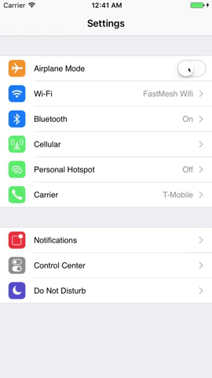
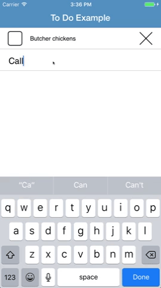
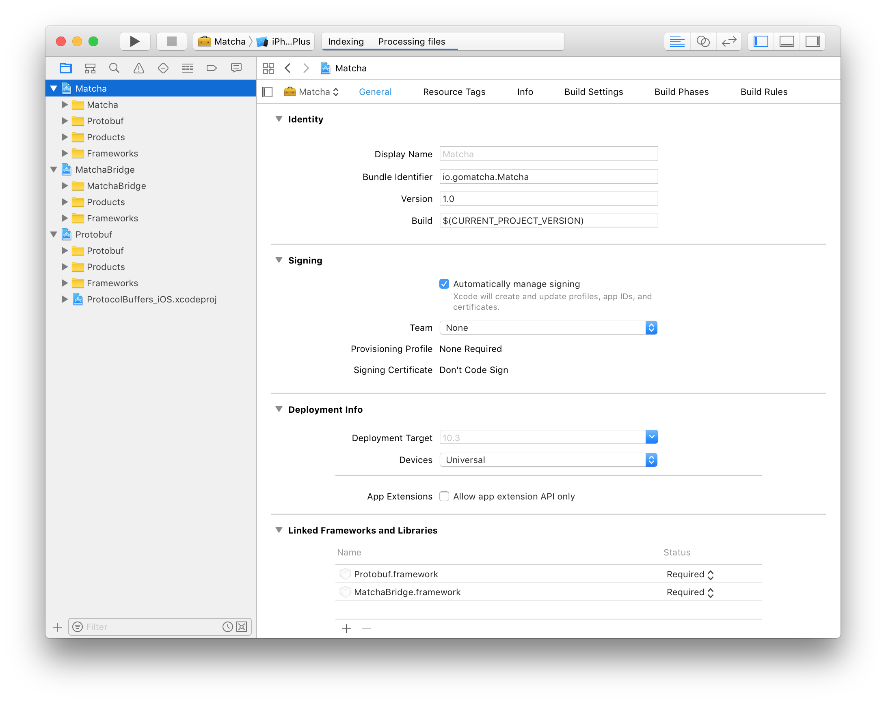
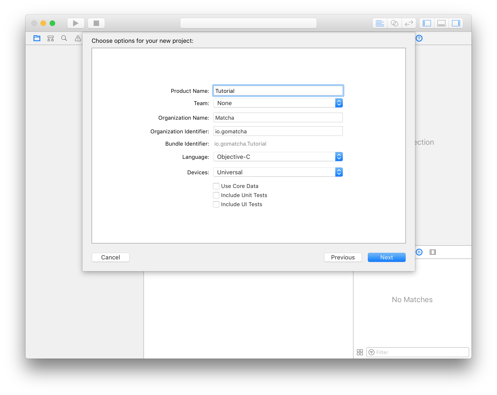
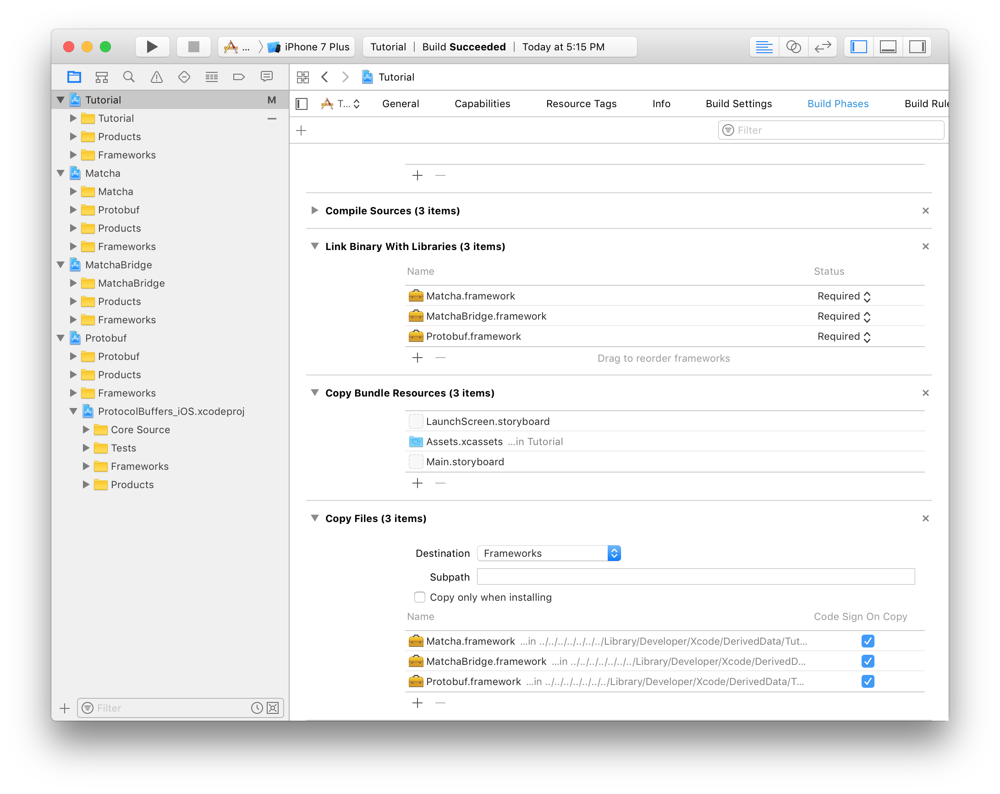
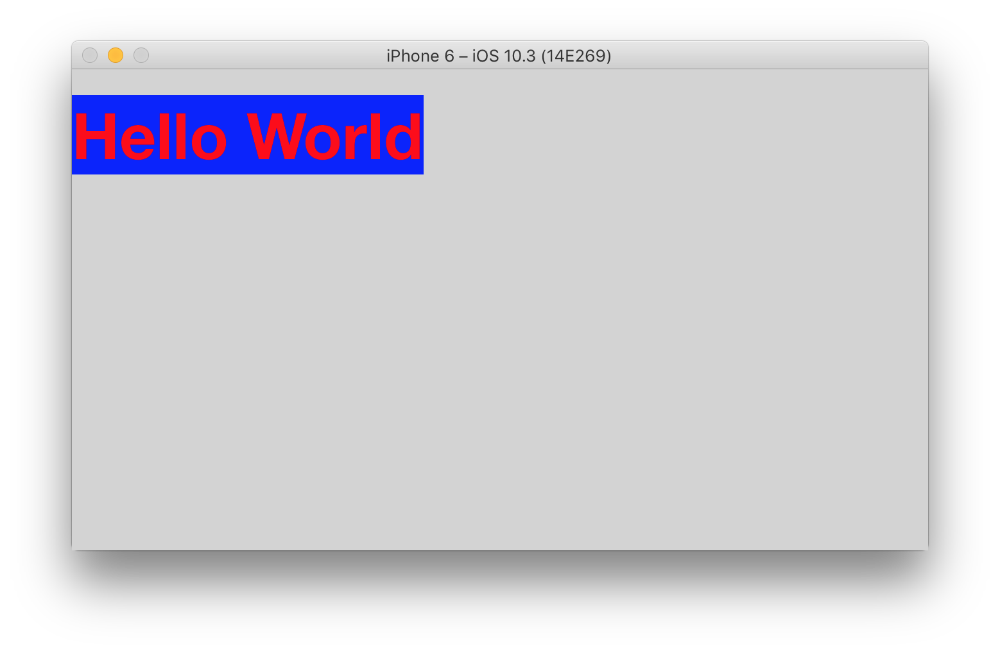

# Matcha - iOS apps in Go

* [Website](https://gomatcha.io)
* [Documentation](https://godoc.org/gomatcha.io/matcha)
* [Slack](https://gophers.slack.com/messages/matcha)

Matcha is in early development! There are many rough edges and APIs may still change. Please file issues for any bugs you find.

### What is Matcha?

Matcha is a package for building iOS applications and frameworks in Go. Matcha provides a UI compenent library similar to ReactNative and exposes bindings to Objective-C code through reflection. The library also provides Go APIs for common app tasks. Matcha makes it easy to build complex mobile apps and integrate with existing projects. 

### Examples

[](https://github.com/gomatcha/matcha/tree/master/examples/settings) [](https://github.com/gomatcha/matcha/tree/master/examples/todo)

### Getting Started

Matcha requires macOS, Xcode 8.3 and Go 1.8. To start, fetch the project and install the matcha command.

    go get gomatcha.io/matcha/...

Now we build the standard library for the device and the simulator with the following command. The output is installed at `$GOPATH/pkg/matcha`. If your path doesn't contain $GOPATH/bin, you may need to replace these calls with `$GOPATH/bin/matcha`.

    matcha init

With this in place, build the example project. The output is installed at `$GOPATH/src/gomatcha.io/matcha/ios/MatchaBridge/MatchaBridge/MatchaBridge.a`.

    matcha build gomatcha.io/matcha/examples

Thats it! We can now open the example Xcode project and run the app! You may also need to set the Development Team under General > Signing.

    open $GOPATH/src/gomatcha.io/matcha/examples/ios-app/SampleApp.xcworkspace

### Tutorial

Here we will walk you through the steps for building a simple Hello World app. It assumes basic knowledge of iOS and Go development. Please go through the Getting Started guide if you have not already done so. 

Crate a directory for your app in your $GOPATH.

    mkdir -p $GOPATH/src/github.com/overcyn/tutorial
    
Now create a Xcode workspace in this directory and add the projects found in `$GOPATH/src/gomatcha.io/matcha/ios/`. There are 3 projects, Matcha, MatchaBridge, and Protobuf. You can do this by dragging the projects into your workspace. At this point you should be able to build the Matcha.framework.



Create a new Xcode project containing a Single View Application in your directory, and add it to the workspace.



Your workspace should now enclose 4 projects. We now need to make some changes to the Xcode project settings.

* Select your development team in General > Signing > Team.
* Disable Bitcode in Build Settings > Build Settings > Enable Bitcode.
* Link and copy in frameworks in Build Phases > Link Binaries with Libraries and Build Phases > Copy Files.



Thats all the setup thats needed, now to start writing code! Create a new go file in the directory with the following snippet. This is a lot to take in at once, but we'll try to go through it step by step in the comments.

```go
package tutorial

import (
    "golang.org/x/image/colornames"
    "gomatcha.io/matcha/layout/constraint"
    "gomatcha.io/matcha/paint"
    "gomatcha.io/matcha/text"
    "gomatcha.io/matcha/view"
    "gomatcha.io/matcha/view/textview"
)

// Here is our root view.
type TutorialView struct {
    // All components must implement the view.View interface. A basic implementation
    // is provided by view.Embed.
    view.Embed
}

// This is our view's initializer.
func New(ctx *view.Context, key string) *TutorialView {
    // To prevent rebuilding the entire tree on every rerender, initializers will return
    // the previous view if it already exists. Most views will contain this bit
    // of boilerplate.
    if v, ok := ctx.Prev(key).(*TutorialView); ok {
        return v
    }
    // If there was no matching view, we create a new one.
    return &TutorialView{Embed: ctx.NewEmbed(key)}
}

// Similar to React's render function. Views specify their properties and
// children in Build().
func (v *TutorialView) Build(ctx *view.Context) view.Model {
    l := &constraint.Layouter{}

    // Get the textview for the given key (hellotext), either initializing it or fetching
    // the previous one.
    textv := textview.New(ctx, "hellotext")
    textv.String = "Hello World"
    textv.Style.SetTextColor(colornames.Red)
    textv.Style.SetFont(text.Font{
        Family: "Helvetica Neue",
        Face:   "Bold",
        Size:   50,
    })
    textv.PaintStyle = &paint.Style{BackgroundColor: colornames.Blue}

    // Layout is primarily done using a constraints. More info can be
    // found in the matcha/layout/constraints docs.
    l.Add(textv, func(s *constraint.Solver) {
        s.Top(20)
        s.Left(0)
    })

    // Returns the view's children, layout, and styling.
    return view.Model{
        Children: []view.View{textv},
        Layouter: l,
        Painter:  &paint.Style{BackgroundColor: colornames.Lightgray},
    }
}
```

Now that we have our view in Go, we need to be call it from Objective C. We can do this with the `gomatcha.io/bridge` package. 

```go
import "gomatcha.io/bridge"

func init() {
    // Registers a function with the objc bridge. This function returns
    // a view.Root, which can be display in MatchaViewController.
    bridge.RegisterFunc("github.com/overcyn/tutorial New", func() *view.Root {
        // Call the TutorialView initializer.
        return view.NewRoot(New(nil, ""))
    })
}
```

Build the Go code.

```
matcha build github.com/overcyn/tutorial
```

Now for the Objective C code. Add imports for Matcha in `AppDelegate.m`.

```objectivec
#import <Matcha/Matcha.h>
```

And replace `application:didFinishLaunchingWithOptions:` with the following.

```objectivec
- (BOOL)application:(UIApplication *)application didFinishLaunchingWithOptions:(NSDictionary *)launchOptions {    
    MatchaGoValue *rootVC = [[[MatchaGoValue alloc] initWithFunc:@"github.com/overcyn/tutorial New"] call:nil args:nil][0];
    self.window = [[UIWindow alloc] initWithFrame:[[UIScreen mainScreen] bounds]];
    self.window.rootViewController = [[MatchaViewController alloc] initWithGoValue:rootVC];
    [self.window makeKeyAndVisible];
    return YES;
}
```

And run your application! Well done!



### FAQ

#### Is there Bitcode support?

Bitcode is an LLVM feature that is not supported by Go at this time.

#### What are other similar libaries?

* https://github.com/golang/mobile
* https://github.com/murlokswarm/app
* https://github.com/andlabs/ui
* https://github.com/golang/exp/tree/master/shiny
* https://github.com/cztomczak/cef2go
* https://github.com/google/gxui
* https://github.com/go-ui/ui